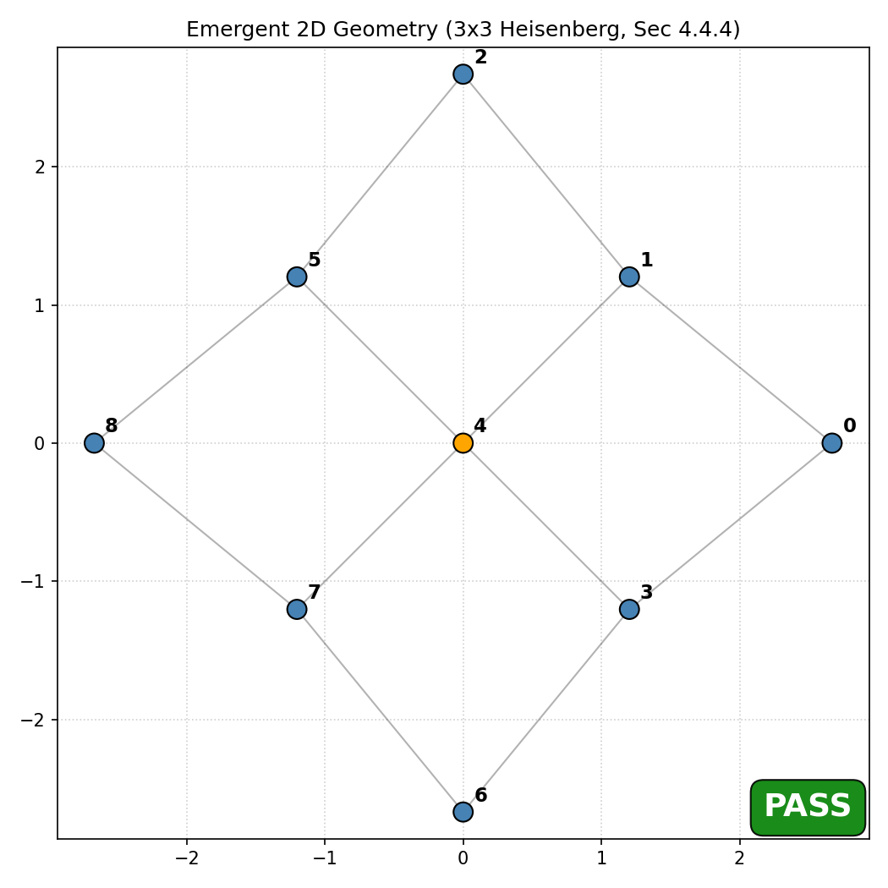

# POPGP: finite quantum correlation and clock-constraint experiments

[](https://doi.org/10.5281/zenodo.18728240)
[](https://www.python.org/downloads/)
[](LICENSE)

POPGP is a research framework and simulator for testing whether finite quantum
correlations can support relational topology, low-dimensional embeddings, and
clock-rate constraints. The current code provides controlled toy-model evidence;
it does not derive General Relativity, establish a physical gravitational source
law, or demonstrate singularity resolution.

> The theoretical proposal is [*A Phase-Ordered Pre-Geometric Projection
> Framework*](https://doi.org/10.5281/zenodo.18728240) (R. Fuoco, 2026). The
> manuscript contains conjectures and proposed falsification criteria beyond the
> implemented simulator.

## Toy-model validation results

All figures below are reproducible with fixed seeds and machine-readable reports.

<p align="center">
  
  &nbsp;
  
</p>

- **Left:** A label-blind correlation-gap rule applied to the mutual-information
  matrix of a 3×3 Heisenberg thermal state recovers all 12 held-out interaction
  edges in this benchmark (precision and recall 1.0), then selects a two-dimensional
  MDS embedding. The Hamiltonian contains a grid interaction graph, so this is
  coordinate-free reconstruction of encoded locality—not topology-free emergence.
- **Right:** A small negative diagnostic source on the inferred weighted graph
  produces a negative potential well, slower source clocks, and positive
  emitter-to-boundary redshift under `dτ ∝ exp(Φ)`. This validates the numerical
  Green-function solve and sign convention only; the source is manually injected.

Regenerate them with:

```text
uv run --frozen --no-editable python -m examples.physics_qg.grid_2d
uv run --frozen --no-editable python -m examples.physics_qg.gravity_well
```

## Quick start

Install [uv](https://docs.astral.sh/uv/), then run:

```text
uv sync --frozen --no-editable
uv run --frozen --no-editable ruff check .
uv run --frozen --no-editable python scripts/check_tex.py
uv run --frozen --no-editable python -m pytest -q -p no:cacheprovider
uv run --frozen --no-editable python -m examples.physics_qg.chain_1d
uv run --frozen --no-editable python -m examples.physics_qg.grid_2d
uv run --frozen --no-editable python -m examples.physics_qg.gravity_well
uv run --frozen --no-editable python -m examples.physics_qg.source_law
uv run --frozen --no-editable python -m examples.physics_qg.source_law_many_body
uv run --frozen --no-editable python -m examples.physics_qg.ca_model
uv run --frozen --no-editable python -m scripts.check_validation_artifacts --enforce-change-boundary
```

Programmatic usage:

```python
from popgp import Simulator, SimulatorConfig

config = SimulatorConfig.for_grid(width=3, height=3, beta=2.0)
result = Simulator(config).run()

print(f"Selected embedding dimension: {result.pi_geom.D_star}")
print(f"Blindly inferred edges: {result.pi_loc.edges}")
print(f"Clock source status: {result.pi_time.source_status}")
```

The advertised grid constructor uses one qubit per cell and runs as written.
Exact density-matrix simulation is the supported end-to-end path. Above the exact
threshold, the mean-field CUDA backend cannot compute mutual information and the
locality stage fails explicitly instead of substituting a false MI proxy.

The experimental native engine can be built separately. It requires a CUDA Toolkit,
CMake, Ninja, and a supported C++ compiler; dependencies are pinned through the
engine's vcpkg manifest. On Windows, from a developer shell or an ordinary shell with
Visual Studio installed:

```text
cd popgp_engine
build.bat --clean --test --cuda-arch native
```

Use an explicit architecture such as `--cuda-arch 120` when producing a frozen
Blackwell build receipt. This validates the native mean-field kernels only; it does
not lift the exact-backend limitation on MI/QCMI or establish scalable scientific
viability.

## What is implemented

### Resolution selection (`Π_res`)

For small exact systems, the code enumerates equal-size partitions, applies a
retention constraint and sampled SU(2)-equivariance check, and ranks admissible
partitions using common-random-number leakage probes with a drift tie-breaker. In
the 8-qubit chain benchmark it selects contiguous two-qubit blocks. Exhaustive
search is a finite toy-model surrogate; the proposed causal gradient-flow
attractor and its equivalence to this minimizer have not been established.

### Correlation topology (`Π_loc`)

The exact backend computes pairwise quantum mutual information. The default blind
connectivity rule identifies the largest multiplicative gap in positive MI values,
reports whether that gap clears a configured separability threshold, and adds a
minimum spanning tree only if needed for connectivity. A fixed-k k-NN baseline is
still available. Ground-truth Hamiltonian edges are used only after inference for
validation metrics and plots.

The controlled 8-site chain and 3×3 grid are exactly recovered at the published
parameters. The four-cell chain result is MST-degenerate: its three reference edges
are exactly the minimum spanning tree and therefore provide no discrimination beyond
connectivity. These results are not yet evidence of robustness to long-range models,
non-geometric controls, larger lattices, or topological entanglement. The proposed
QCMI/Markov filtering stage is not implemented.

### Embedding diagnostics (`Π_geom`)

Classical MDS embeds graph-geodesic distances. The selected dimension minimizes

`stress(D) + λ_dim (D - D_spectral)^2`

over dimensions supported by the number of graph nodes. Reports keep unpenalized
stress separate from the selection objective. The heat-kernel quantity is reported
as a scale-dependent **finite-graph peak**, because finite graphs have zero spectral
dimension in both asymptotic limits. The current benchmarks select D*=1 for the
chain and D*=2 for the grid, but parameter and refinement studies remain required.

The pipeline now fits regularized SPD metrics in the selected MDS coordinates and
reports rank, condition number, and residual at every node. For 2D geometric
candidates it can also build an explicitly labeled embedding-space Delaunay/angle-
deficit proxy. These are diagnostic prototypes: intrinsic complex construction,
dual-volume Regge curvature, refinement convergence, Einstein closure, and
Bianchi/conservation tests are not implemented.

### Clock constraint (`Π_time`)

The numerical solver handles the graph-Laplacian zero mode without pinning an
arbitrary node. For an unscreened finite graph it either subtracts the constant
source mode or rejects an incompatible source; screened solves can be normalized
to report only clock-rate contrasts. The redshift convention is

`1 + z = exp(Φ_observer - Φ_emitter)`.

The standard pipeline still defaults to local von Neumann entropy as an explicitly
non-physical placeholder. Explicit negative relative-entropy and modular-energy
candidate modes accept a caller-supplied reference state. Near a faithful reference,
relative entropy and the resulting potential begin at second order in perturbation
amplitude. Under an affine state mixture, modular energy, physical energy, and the
linear graph solve are exactly proportional to the mixture amplitude by algebra; their
unit slopes are identity regressions, not falsification tests. Equal-energy KMS controls
also show that raw relative entropy changes with entropy at fixed energy.
Raw relative entropy is therefore falsified as a standalone linear mass source in
this regime. The original reduced-state modular-energy mode is also explicitly
retained as a negative control: it is blind to the symmetric KMS-chain excitation
because each one-site reference modular Hamiltonian is proportional to the identity.

An exact five-site experiment now uses the genuinely non-affine family
`rho(epsilon) proportional to exp[-beta(H + epsilon V)]` with localized
`V = -h_center`. Direct coefficient, slope, residual, precision-floor, and negative-
control gates verify quadratic relative entropy. A signed Richardson estimate finds
a nonzero first-order modular susceptibility and agrees with the exact Kubo--Mori
value over the declared finite sweep (`beta <= 3`, including `beta = 2.5`). Physical
energy follows by the exact KMS identity. The result is family-specific: for an
isospectral local
unitary family, `Delta S = 0` and `D = Delta<K> = beta Delta<E>` are all quadratic.
A separate quench shows profile spreading under Heisenberg dynamics, while a commuting
Ising control shows no spreading. Constancy of the measured global Hamiltonian under
its own unitary evolution is retained as an implementation-consistency identity, not
as source-law evidence. This makes modular energy a feasible localized test object in
those controlled models, not a final source law. Temporal averaging, covariant
conservation, scalable/refinement behavior, and an independent operational clock
observable remain open.

For integration testing, the exact backend exposes a separate
`negative_kms_energy_density_candidate`. It uses `−β Δ⟨h_i⟩` from the
declared microscopic Hamiltonian split. The runtime accepts this KMS-labelled source
only when the supplied reference is within trace distance `1e-10` of the Gibbs state
for that same Hamiltonian and β; under that validated premise, the source sums to
minus the global KMS modular-energy change. It is not interchangeable with the
reduced-state candidate. Its dependence on the supplied interaction graph and
energy-density convention is an explicit limitation.

## Repository map

- `popgp/`: exact simulator, information primitives, geometry diagnostics, and CUDA binding.
- `tests/unit/`: mathematical and implementation invariants.
- `tests/scientific/`: source-law, sign, scaling, topology, and permutation tests.
- `examples/physics_qg/`: reproducible finite toy models and validation JSON.
- `docs/scientific_hardening/`: claim classification, theory/code gaps, and staged
  falsification plan, including the
  [`adversarial viability demonstration plan`](docs/scientific_hardening/VIABILITY_DEMONSTRATION_PLAN.md).
- `schemas/viability/` and `scripts/check_viability_campaign.py`: versioned, Git-bound
  campaign/protocol contracts plus the fail-closed dependency, custody, evidence,
  receipt, review-chain, and outcome validator used by adversarial-agent campaigns.
- `popgp_engine/`: experimental CUDA components. The native clock solver is still
  an identity stub, and renderer curvature code is not integrated with the Python
  projection pipeline.

## Current evidence and open claims

| Topic | Current status |
|---|---|
| Exact finite-dimensional entropy and relative entropy | Implemented with support checks |
| Chain/grid MI edge recovery | Passes selected finite benchmarks |
| Label-permutation invariance | Covered by scientific regression test |
| Dimension selection | Passes selected chain/grid parameters; not a continuum result |
| Finite graph clock constraint and redshift sign | Numerically validated |
| Physical Araki/KMS source | Raw RE and naive reduced localization fail; microscopic KMS energy is a finite-model candidate |
| QCMI filtering and non-geometric controls | Not implemented / incomplete |
| Local metric / angle deficits | Embedding-space diagnostics; intrinsic Regge geometry open |
| Newtonian/GR closure | Not demonstrated |
| Lorentz recovery | Conjectural |
| Singularity resolution or causal completeness | Conjectural |

## Reproducibility and review

Each example writes `results/validation.json`; a passing JSON check supports only
the criterion named in that check. Negative results are retained. See
[`docs/scientific_hardening`](docs/scientific_hardening/) for claim-by-claim scope,
acceptance criteria, and unresolved risks. The
[`viability demonstration plan`](docs/scientific_hardening/VIABILITY_DEMONSTRATION_PLAN.md)
turns the open requirements into frozen, falsifiable work packets for gated
adversarial-agent campaigns.

Independent agent reviews follow the repository-authored
[`agent review workflow`](docs/governance/AGENT_REVIEW_WORKFLOW.md). The
[`review launch runbook`](docs/reviews/LAUNCH_INDEPENDENT_REVIEW.md) provides frozen
worktree commands, copy/paste initial-review and re-review prompts, required handoff
fields, and links to the review, response, and disagreement templates.

Contributions should include unit tests for implementation changes and scientific
regression or falsification tests for physical claims. Please report contradictions
between the manuscript, examples, and code as first-class issues.

## Citation

```bibtex
@misc{fuoco2026popgp,
  author       = {Fuoco, Richard},
  title        = {A Phase-Ordered Pre-Geometric Projection Framework},
  year         = {2026},
  howpublished = {\url{https://github.com/rfuoco/POPGP}},
  note         = {v1.0, Submission Draft}
}
```

POPGP is developed by Richard Fuoco and released under the MIT License.
