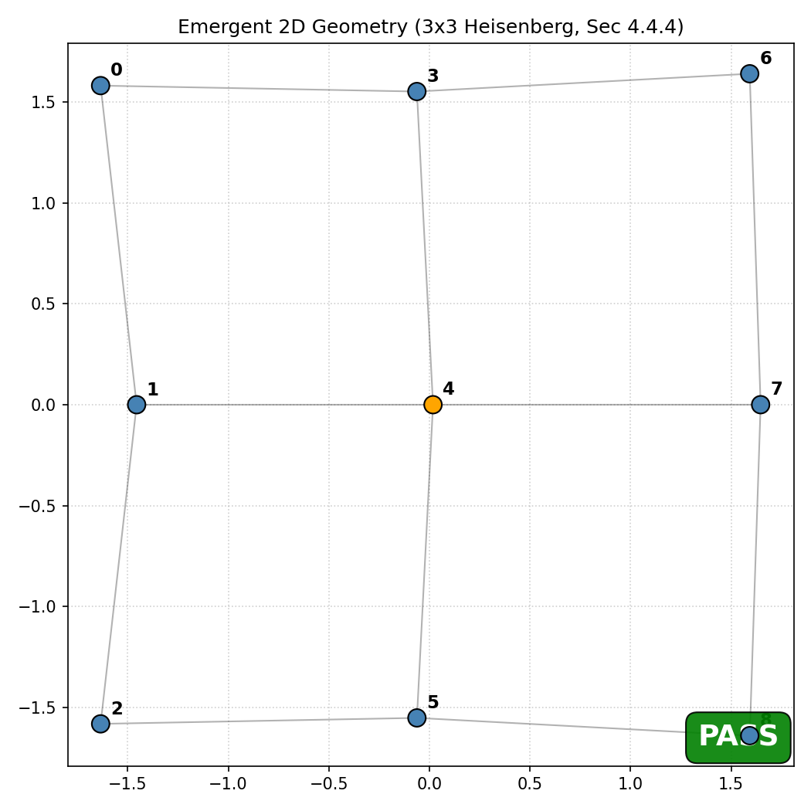
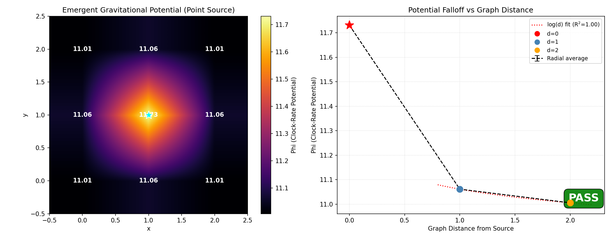

# POPGP Quantum Simulations: Emergent Geometry & Gravity from Algebraic Substrates

[](https://doi.org/10.5281/zenodo.18728240)
[](https://www.python.org/downloads/)
[](LICENSE)

Exact quantum simulations that kinematically extract discrete spatial topologies ($D^*$), locally flat relational metrics ($h_{ab}$), and non-local Newtonian clock-rate potentials ($\Phi$) strictly from the Araki relative entropies of thermal density matrices — with no assumed background manifold, no metric input, and no spatial priors.

> **Read the foundational theoretical manuscript:** [*A Phase-Ordered Pre-Geometric Projection Framework*](https://doi.org/10.5281/zenodo.18728240) (R. Fuoco, 2026)

---

## Visual Proofs

All outputs below are generated by `uv run python -m examples.<name>` with fixed random seeds.

<p align="center">
  
  &nbsp;
  
</p>

<p align="center"><em>
Left: 2D grid topology recovered via MDS on graph-geodesic distances derived from mutual information of a 9-qubit Heisenberg thermal state. The algorithm receives no spatial input; it recovers the exact lattice connectivity and dynamically selects $D^* = 2$.
Right: Clock-rate potential $\Phi$ from a localized entropy-deficit source on a 2D MI-weighted correlation graph. The screened graph-Poisson equation $(\Delta_w + \mu^2 I)\Phi = \delta\rho$ produces monotonic radial falloff, preserves lattice symmetry, and yields exact discrete gravitational redshift $1 + z = \exp(\Phi_A - \Phi_B)$.
</em></p>

> **To regenerate these figures:** `uv run python -m examples.grid_2d && uv run python -m examples.gravity_well`

---

## Quick Start

**Prerequisites:** [Install uv](https://github.com/astral-sh/uv) (Python package manager).

```bash
# Install all dependencies
uv sync

# Run the full pipeline on a 2D Heisenberg grid (9-qubit exact diag.)
uv run python -m examples.grid_2d

# Run the gravity-well observable extraction
uv run python -m examples.gravity_well

# Additional examples
uv run python -m examples.chain_1d       # 1D geometry + stability selection
uv run python -m examples.ca_model       # Cellular automata radiative cooling
```

Each example writes structured validation output to `results/validation.json` with machine-readable metrics and PASS/FAIL diagnostics.

**Programmatic usage:**

```python
from popgp import Simulator, SimulatorConfig

cfg = SimulatorConfig.for_grid(width=3, height=3, beta=2.0)
sim = Simulator(cfg)
result = sim.run()

print(f"Emergent dimension: D* = {result.pi_geom.D_star}")
print(f"Clock potential range: [{result.pi_time.phi.min():.3f}, {result.pi_time.phi.max():.3f}]")
```

> [Run the Interactive POPGP Pipeline in Google Colab](https://colab.research.google.com/)  *(link pending)*

---

## The Projection Pipeline

The codebase implements a four-stage constructive projection $\Pi = \Pi_{\text{time}} \circ \Pi_{\text{geom}} \circ \Pi_{\text{loc}} \circ \Pi_{\text{res}}$ that maps an atemporal algebraic substrate $(\mathcal{A}, \omega)$ to emergent spacetime observables. Each stage is an executable algorithm with quantitative validation.

### $\Pi_{\text{res}}$ — Stability Selection

Identifies projection-stable subsystems (cells) via a causally-bounded gradient flow that minimizes phase-flow leakage $\mathcal{L}_{\text{leak}}$ across cell boundaries under SU(2)-equivariance and finite-capacity constraints. Cells that co-move with the phase-order flow survive; non-local or unstable decompositions are discarded.

**Computed output:** Exhaustive search over all 105 coarse-graining partitions of an 8-qubit Heisenberg chain uniquely recovers contiguous local blocks as the global $\mathcal{L}_{\text{leak}}$ minimum. Locality emerges from stability, not assumption.
**Run:** `uv run python -m examples.chain_1d`

### $\Pi_{\text{loc}}$ — Correlation Graph

Constructs pairwise distances from Araki relative entropy (mutual information) between cells: $d_{ij} = \ell_* \cdot f(I_{ij}/I_0)$. Graph-geodesic distances on the $k$-NN + MST weighted graph encode the relational topology without geometric input.

**Computed output:** On a $3 \times 3$ Heisenberg grid, nearest-neighbour MI exceeds diagonal MI by ${\sim}10\times$, faithfully encoding the lattice connectivity.
**Run:** `uv run python -m examples.grid_2d`

### $\Pi_{\text{geom}}$ — Emergent Geometry via MDS Complexity-Stress

Selects the emergent dimension $D^*$ by minimizing a complexity-stress functional $F(D) = \text{Stress}(D) + \lambda_{\text{dim}}|D - D_S|^2$ that balances embedding fidelity against topological complexity. Classical MDS embeds the graph-geodesic distance matrix into $\mathbb{R}^{D^*}$. Local metric $h_{ab}$ is reconstructed via SPD-regularized least-squares on neighbour distances.

**Computed output:** The functional dynamically selects $D^* = 1$ for 1D chains and $D^* = 2$ for 2D grids, with no manual spatial input.
**Run:** `uv run python -m examples.grid_2d` (dimension selection) / `uv run python -m examples.chain_1d` (1D validation)

### $\Pi_{\text{time}}$ — Clock-Rate Potential and Emergent Gravity

Solves the screened graph-Laplacian equation $(\Delta_w + \mu^2 I)\Phi = \delta\rho$ where $\delta\rho_i$ is the Araki entropy contrast against the KMS vacuum. The resulting potential $\Phi$ governs local proper time $d\tau = \beta_0 \exp(\Phi)\, dS_{\text{act}}$ and is structurally identical to the Newtonian gravitational potential.

**Computed output:** Localized entropy-deficit source on a 2D graph produces monotonic radial $\Phi$ falloff, exact lattice symmetry preservation, and discrete gravitational redshift $1 + z = \exp(\Phi_A - \Phi_B)$.
**Run:** `uv run python -m examples.gravity_well`

---

## Repository Structure

*   `docs/`: Core theoretical documents.
    *   [`framework.md`](docs/framework.md): The principal definition of the framework (v1.0, Submission Draft).
    *   [`simulator_analysis_and_plan.md`](docs/simulator_analysis_and_plan.md): Codebase analysis and implementation roadmap.
*   `popgp/`: Python package — the unified simulator.
    *   `config.py`: Canonical parameter configuration (every parameter labeled).
    *   `backend.py`: Backend abstraction (`ExactBackend` / `GPUBackend`).
    *   `simulator.py`: Unified projection pipeline.
    *   `coarse_grain.py`: Variational cell selection (Phase 1).
    *   `capacity.py`: Cut-capacity functional and Araki bounds.
    *   `engine.py`: Lazy-loaded Python bindings for the C++/CUDA kernel.
*   `popgp_engine/`: High-performance C++/CUDA engine.
    *   `kernel/`: Phase-flow kernel, area-law cut, clock solver (stub).
    *   `renderer/`: 3D visualization pipeline (planned).
*   `examples/`: Runnable demonstrations (each is a Python package with its own README).
    *   `chain_1d/`: 1D stability selection and geometry recovery.
    *   `grid_2d/`: 2D emergent geometry from scrambled algebra.
    *   `ca_model/`: Cellular automata stability selection and cooling.
    *   `gravity_well/`: Localized source test — first gravitational observable.

## Status

*   **Conceptual Framework:** v1.0 (Submission Draft)
*   **Simulator Architecture:** Implemented (config, backends, unified pipeline)
*   **Validation:**
    *   [x] 1D Geometry Emergence
    *   [x] 2D Grid Emergence from Scrambled Algebra
    *   [x] Stability Selection via Thermodynamics (CA Model)
    *   [x] Spectral dimension and complexity-stress dimension selection
    *   [x] Clock potential via graph Laplacian
    *   [x] Strict cell selection with SU(2) equivariance (Phase 1)
    *   [x] Gravity well: localized source with monotonic potential falloff + redshift
*   **Next Steps:**
    *   [ ] Local metric reconstruction and Delaunay / Regge curvature
    *   [ ] Araki source term with KMS vacuum baseline
    *   [ ] Observables: gravitational lensing, Shapiro delay
    *   [ ] 3D gravity simulation and GR matching

---

## Contributing & Peer Review

This is an active research codebase. Contributions from tensor network specialists, quantum information scientists, and researchers working on emergent gravity, Regge calculus, or algebraic QFT are welcome.

To contribute:

1. Fork the repository and create a feature branch.
2. Ensure all examples produce `PASS` in `validation.json` before submitting.
3. Open a pull request with a description of the physics being tested or extended.

If you identify a theoretical inconsistency between the simulation outputs and `docs/framework.md`, please open an issue — falsification is a feature of this framework, not a bug.

## Citation

If you use this codebase or the POPGP framework in your research, please cite:

```bibtex
@misc{fuoco2026popgp,
  author       = {Fuoco, Richard},
  title        = {A Phase-Ordered Pre-Geometric Projection Framework},
  year         = {2026},
  howpublished = {\url{https://github.com/rfuoco/POPGP}},
  note         = {v1.0, Submission Draft}
}
```

---

*POPGP is developed by Richard Fuoco. The framework and all simulation code are released under the MIT License.*
