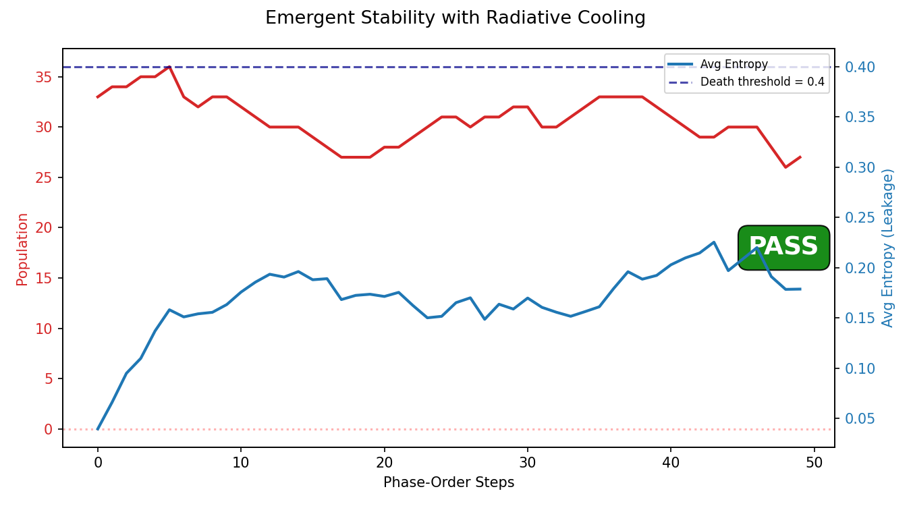
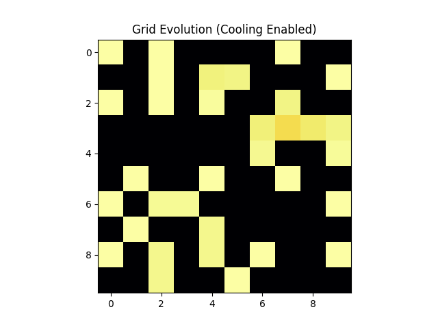

# Cellular Automata: Stability Selection & Radiative Cooling

Simulation of a population of qubit-like "cells" on a grid. Demonstrates the
framework's **stability selection principle** in a dynamical, biological-like
context: cells that leak too much information (entropy exceeds a threshold) die,
while stable cells persist and replicate.

This model is **phenomenological** — it uses Bloch-sphere cells rather than full
quantum mechanics. It does not use the unified `Simulator` API because its
dynamics are fundamentally different from the exact density-matrix pipeline
(no Hamiltonian, no partial trace, no MI-based geometry). It stands as a
conceptual illustration of the stability selection principle, not a strict
framework implementation.

## Framework Sections Validated

| Principle | Framework Reference | What this script tests |
|---|---|---|
| Stability Selection | Section 4.4.2a | Cells with entropy above `LEAKAGE_THRESHOLD` are eliminated. |
| Emergent Persistence | Section 4.4.2a | Populations of stable cells self-organise and persist over time. |
| Radiative Cooling | Section 4.4.2a | Entropy export ("cooling") is necessary for dense, stable populations. |

## Cell Representation

Each cell is a single effective qubit represented by a Bloch vector (rx, ry, rz):
- **Radius** |r| = 1 → pure state (zero entropy, maximum stability).
- **Radius** |r| < 1 → mixed state (non-zero entropy, less stable).
- **Entropy**: S = -p₁ log(p₁) - p₂ log(p₂), where p₁,₂ = (1 ± |r|)/2.
- **Purity**: (1 + |r|²)/2.

## Algorithm (per time step)

### 1. Interaction Phase
For each cell with neighbours (Von Neumann neighbourhood):
- **Purity decay**: Bloch vector shrinks proportional to misalignment with neighbours.
  Decay rate ∝ (1 - dot²) × DECAY_RATE × dt. Aligned cells decay less; orthogonal cells decay most.
- **Alignment force**: small pull toward neighbour average (self-organisation).

### 2. Selection Phase
- Cells with entropy > `LEAKAGE_THRESHOLD` (0.4) are removed from the grid.

### 3. Cooling Phase
- Each surviving cell has probability `COOLING_PROB` (0.02) of resetting to a pure
  state (direction preserved, magnitude restored to 1). Models radiative cooling /
  entropy export to an environment.

### 4. Reproduction Phase
- Cells with very low entropy (< `REPRO_PURITY_THRESHOLD`) have probability
  `REPLICATION_PROB` (0.05) to replicate into an empty neighbouring site with
  small Bloch-vector mutation.

## Parameters

All parameters are labeled per docs/framework.md §4.6.3.

| Parameter | Value | Classification |
|---|---|---|
| WIDTH × HEIGHT | 10 × 10 | STRUCTURAL_CHOICE |
| INITIAL_DENSITY | 0.4 | TUNABLE_HYPERPARAMETER |
| LEAKAGE_THRESHOLD | 0.4 | TUNABLE_HYPERPARAMETER |
| REPLICATION_PROB | 0.05 | TUNABLE_HYPERPARAMETER |
| MUTATION_RATE | 0.02 | TUNABLE_HYPERPARAMETER |
| COOLING_PROB | 0.02 | TUNABLE_HYPERPARAMETER |
| DECAY_RATE | 0.3 | TUNABLE_HYPERPARAMETER |
| ALIGN_STRENGTH | 0.1 | TUNABLE_HYPERPARAMETER |
| DT | 0.1 | TUNABLE_HYPERPARAMETER |
| REPRO_PURITY_THRESHOLD | 0.1 | TUNABLE_HYPERPARAMETER |
| STEPS | 50 | TUNABLE_HYPERPARAMETER |

## How to Run

```bash
uv run python -m examples.physics_qg.ca_model
```

## Results and How to Interpret

### Population Dynamics — `results/dynamics_cooling.png`



**What you see**: A dual-axis line chart over time steps. A **PASS/FAIL** badge
is in the corner. A blue dashed horizontal line marks the entropy death threshold.

**Visual elements**:
- **Red line (left y-axis)** = live cell count at each step.
- **Blue line (right y-axis)** = average entropy of surviving cells.
- **Blue dashed horizontal line** = the `LEAKAGE_THRESHOLD` (0.4). Cells above
  this line are culled each step. The average entropy of survivors should remain
  well below this line.

**PASS criteria** (Section 4.4.2a):
1. **Population survives**: The red line does not crash to zero. The population
   stabilizes or grows from the initial seed, reaching a dynamic equilibrium
   where births (replication) balance deaths (entropy culling).
2. **Entropy stays controlled**: The blue line remains below the dashed threshold.
   The average entropy of survivors should be well below 0.4, indicating the
   population is collectively stable and pure.

**FAIL indicators**:
- **Population crashes to zero**: The red line drops to 0 and stays there. This
  means cooling is insufficient — interactions steadily increase entropy until
  every cell exceeds the death threshold. Try increasing `COOLING_PROB` or
  decreasing `DECAY_RATE`.
- **Entropy rises to or above threshold**: The blue line approaches or exceeds
  the dashed line. This means selection pressure is not keeping up with
  entropy production. The population may survive but is unhealthy.
- **Population oscillates wildly**: Large boom-bust cycles suggest the
  parameters are near a critical boundary. The system is marginally stable.

**Key scientific insight**: If you set `COOLING_PROB = 0` (disable entropy
export), the population **always** collapses. Interactions between misaligned
cells always increase entropy (they act as a decoherence channel). Without an
entropy export mechanism (cooling), every cell eventually exceeds the death
threshold. This confirms the framework's prediction that **open systems with
entropy export are necessary for persistent, stable structures** — a direct
analogy to radiative cooling in astrophysics and the second law in biology.

---

### Grid Evolution Animation — `results/evolution_cooling.gif`



**What you see**: An animated heatmap of the grid, one frame per time step,
using the 'inferno' colour map.

**Visual elements**:
- **Bright yellow/white cells** = high purity (Bloch radius near 1), low entropy,
  very stable. These are the "winners" of stability selection.
- **Dark red/orange cells** = moderate purity, approaching the death threshold.
  These are at risk of being culled next step.
- **Black squares** = empty sites (no cell present).

**What to look for (success)**:
- **Early frames**: Sparse distribution of bright cells with many dark gaps.
  Some initial cells are already unstable and die in the first few steps.
- **Middle frames**: Clusters of bright cells begin expanding as stable cells
  replicate into neighbouring empty sites. The spatial clustering is emergent —
  no clustering rule was programmed.
- **Late frames**: Large connected regions of stable (bright) cells filling
  most of the grid, with occasional dark patches where local interactions are
  driving entropy up.

**What indicates failure**:
- The grid goes entirely black (all cells dead) — see population crash above.
- No spatial clustering emerges — cells blink on and off randomly without
  forming coherent regions. This suggests the alignment force is too weak or
  the replication probability is too low for spatial self-organization.

**Why spatial clustering emerges**: Neighbouring cells that are aligned (similar
Bloch vectors) decay each other's purity less (decay ∝ 1 - dot²). So clusters
of aligned cells are mutually stabilizing — they form a kind of "cooperative
purity shield." Misaligned isolated cells, by contrast, quickly decohere and
die. This is a microscopic analogue of the framework's macro principle: locally
coherent subsystems are selected by the projection because they minimize
information leakage to the environment.
