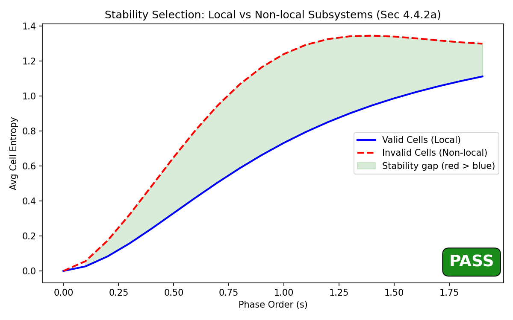
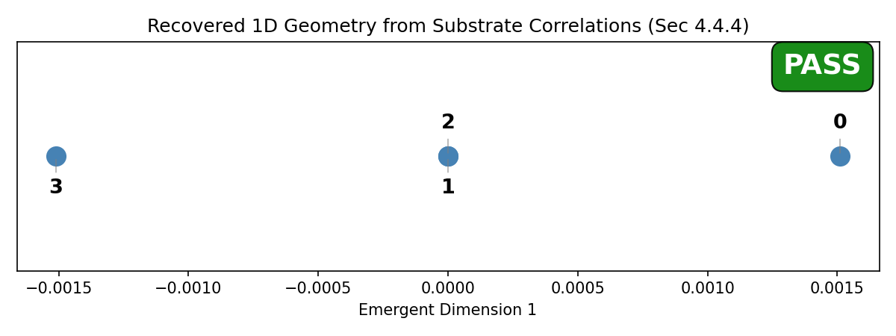
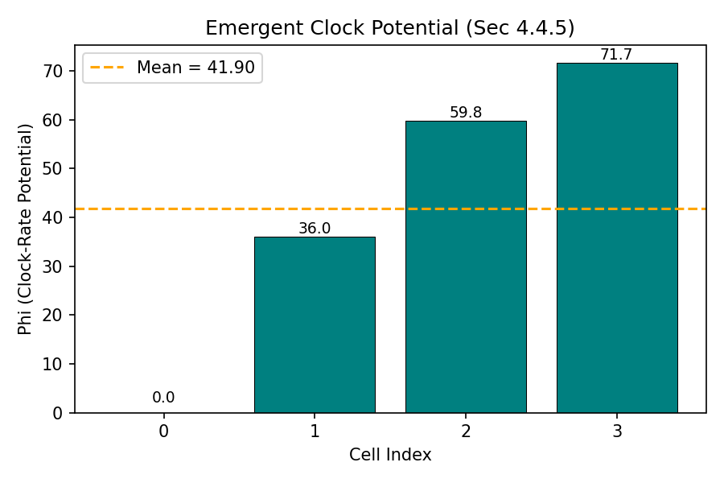

# 1D Heisenberg Chain: Stability Selection & Geometry Recovery

Full-quantum simulation of an 8-qubit Heisenberg spin chain using the unified
`Simulator` API. This is the foundational validation of the POPGP framework —
it proves that stability selection, correlation-based locality, and geometry
recovery all work when the underlying quantum mechanics is exact.

At toy scale (N ≤ 12), the `ExactBackend` is used: full 2^N density matrices,
exact diagonalization, exact partial traces, and exact mutual information.
At GPU scale (N > 12), the `GPUBackend` uses the CUDA phase-flow kernel with
mean-field dynamics and Sz-correlation proxies.

## Framework Sections Validated

| Principle | Framework Reference | What this script tests |
|---|---|---|
| Variational Cell Selection | Section 4.4.2a | Full combinatorial search over all 105 equal-size partitions of 8 qubits into 2-qubit cells. The optimizer selects contiguous blocks `[[0,1],[2,3],[4,5],[6,7]]` as the unique leakage minimizer — locality **emerges** from the stability principle, not from assumptions. |
| SU(2) Equivariance | Section 4.4.2a, E4 | Each admissible partition is checked for `E_i ∘ α_g = α_g ∘ E_i`. For partial-trace coarse-graining with tensor-product SU(2) actions, equivariance is automatically satisfied (proven analytically, verified numerically). |
| Retention Bound | Section 4.4.2a | The multi-information `D(ω ‖ ω∘E) = Σ S(ρ_i) − S(ρ)` is computed for each partition. Partitions exceeding the retention threshold ε are filtered out before leakage evaluation. |
| Stability Comparison | Section 4.4.2a | Separate dynamic test: evolve a Neel state under phase-flow and compare entropy growth of valid (contiguous) vs invalid (scattered) cells. Invalid cells reach higher entropy faster. |
| Correlation-Based Locality | Section 4.4.3 | Mutual information between cells in a thermal state defines a distance metric d(i,j) = -log(I_ij / I_0). Neighbours have small d; distant cells have large d. |
| Geometry Recovery (MDS) | Section 4.4.4 | Classical MDS applied to the graph-geodesic distance matrix recovers the correct 1D ordering of the cells. |
| Dimension Selection | Section 4.4.4 | The complexity-stress functional selects D* = 1 as the optimal embedding dimension. |
| Emergent Time | Section 4.4.5 | The clock-rate potential Φ is computed from the graph Laplacian, showing a non-trivial potential landscape on the chain. |

## Algorithm

### Phase 1 — Stability Selection (dynamic)

1. Construct the N-qubit Heisenberg Hamiltonian:
   H = Σ_i (Sx_i·Sx_{i+1} + Sy_i·Sy_{i+1} + Sz_i·Sz_{i+1})
2. Initialise the system in the Neel state |01010101⟩.
3. Evolve the full density matrix under U(dt) = exp(-iHdt) for multiple steps.
4. At each step, compute the entropy S = -Tr(ρ log ρ) of each cell's reduced state
   (this is the finite-dimensional reduction of the Araki relative entropy, §4.4.3):
   - **Valid cells**: contiguous 2-qubit blocks [0,1], [2,3], [4,5], [6,7].
   - **Invalid cells**: scattered pairs [0,4], [1,5], [2,6], [3,7].
5. **Result**: invalid cells reach higher entropy faster — they are less stable.

### Phase 2 — Full Projection Pipeline (Π_res → Π_loc → Π_geom → Π_time)

1. Prepare a thermal state ρ = exp(-βH)/Z at inverse temperature β.
2. **Π_res** (variational): Enumerate all 105 equal-size partitions of 8 qubits into 4 cells of 2 qubits. For each partition: (a) check SU(2) equivariance, (b) check retention bound D(ω ‖ ω∘E) ≤ ε, (c) if admissible, compute L_leak using Hilbert-Schmidt channel norm approximated via random probe states with pre-computed unitaries. Select the partition with minimal L_leak. If tied, break ties by L_drift (Araki relative entropy drift).
3. **Π_loc**: Compute mutual information I(i,j) for all cell pairs; apply canonical distance kernel d = -log(I/I_0); build weighted graph with k-NN + MST; compute graph-geodesic distances.
4. **Π_geom**: Estimate spectral dimension D_S; select D* via complexity-stress; embed via MDS.
5. **Π_time**: Build graph Laplacian from MI weights; solve (Δ_w + μ²I)Φ = δρ; compute proper time dτ.

## Parameters

| Parameter | Value | Role |
|---|---|---|
| N (qubits) | 8 | System size (full Hilbert space 2^8 = 256) [STRUCTURAL_CHOICE] |
| k (block size) | 2 | Qubits per cell → 4 cells, 105 partitions to search [TUNABLE_HYPERPARAMETER] |
| β (temperature) | 1.0 | Inverse temperature for thermal state [TUNABLE_HYPERPARAMETER] |
| dt | 0.1 | Phase-order step size [TUNABLE_HYPERPARAMETER] |
| steps | 20 | Evolution steps for stability measurement [TUNABLE_HYPERPARAMETER] |
| phase_window_width | 2.0 | Width of the phase-order window for L_leak integration [TUNABLE_HYPERPARAMETER] |
| phase_window_samples | 5 | Quadrature points in the integration window [TUNABLE_HYPERPARAMETER] |
| retention_epsilon | 10.0 | Maximum retention loss D(ω ‖ ω∘E); set permissively [TUNABLE_HYPERPARAMETER] |
| n_probe_states | 8 | Haar-random probes for channel-norm approximation [TUNABLE_HYPERPARAMETER] |

## How to Run

```bash
uv run python -m examples.physics_qg.chain_1d
```

## Results and How to Interpret

### Entropy Growth — `results/entropy_growth.png`



**What you see**: Two curves over phase-order time. A green shaded region marks
where the gap is in the expected direction. A **PASS/FAIL** badge is printed in
the corner.

**Visual elements**:
- **Blue solid line** = "Valid" cells (contiguous 2-qubit blocks) — the **local**
  subsystems the framework predicts should be stable.
- **Red dashed line** = "Invalid" cells (scattered pairs like qubits [0,4]) —
  **non-local** subsystems that should be unstable.
- **Green shading** = region where the red curve is above the blue curve (the
  "stability gap"). The larger this region, the stronger the evidence.

**PASS criteria** (Section 4.4.2a):
- The red curve (non-local) rises **faster** and plateaus **higher** than the
  blue curve (local). This means non-local subsystems leak more information to
  their environment. Locality is not assumed — it **emerges** from stability.
- The green shaded gap should persist across most of the time axis.
- The "valid" cells plotted here are the cells *selected by the variational
  optimizer* (which searches all 105 partitions), not hand-picked. The optimizer
  independently recovers contiguous blocks as the leakage minimizer.

**FAIL indicators**:
- The curves overlap throughout, or the blue curve rises above the red.
  This would mean there is no stability advantage to local decompositions,
  contradicting the framework's central prediction.
- A small or transient gap that disappears at late times may indicate the
  system has thermalized and the distinction has been erased — not necessarily
  a failure, but the gap should be present during early-to-mid evolution.
- The optimizer selecting non-contiguous cells as the leakage minimizer would
  indicate the stability principle does not prefer spatially local decompositions
  for this Hamiltonian.

---

### 1D Embedding — `results/embedding.png`



**What you see**: Four numbered points (cells 0–3) plotted along a single
emergent spatial dimension recovered by MDS. Labels are staggered vertically
so overlapping cells are still visible. A **PASS/FAIL** badge is in the corner.

**Visual elements**:
- Each point is a cell's MDS coordinate, derived purely from mutual-information
  distances — **no knowledge of the physical chain was provided to the algorithm**.
- Points that are close together on the line have high mutual information
  (strong correlations); points far apart have low MI.

**PASS criteria** (Section 4.4.4):
- The cells appear in **monotonic order** (0, 1, 2, 3 or 3, 2, 1, 0) after
  grouping coordinates that fall within a tolerance (0.1% of the coordinate
  range or 1e-10, whichever is larger). Cells with nearly identical MI
  distances — such as the two inner cells of a symmetric chain — are assigned
  the same rank; as long as the rank sequence is non-decreasing or
  non-increasing, the test passes. Reflection (reversed order) is a valid
  symmetry of MDS.

**FAIL indicators**:
- Non-monotonic ordering that persists even after tolerance grouping
  (e.g. an outer cell embedded between two inner cells). This would mean
  the MI-derived distances do not faithfully encode the chain's
  nearest-neighbor structure.
- All cells collapsed to a single point. This indicates degenerate distances
  (likely an issue with the MI-to-distance kernel, e.g. I_0 = max causing
  zero distances for the strongest pairs).

---

### Clock Potential — `results/clock_potential.png`



**What you see**: A bar chart showing the clock-rate potential Φ at each cell,
with an orange dashed line marking the mean.

**Visual elements**:
- Each bar is one cell's Φ value, computed by solving the Laplacian equation
  (Δ_w + μ²I)Φ = δρ where δρ is the local entropy contrast relative to the
  global mean (Section 4.4.5).
- The orange dashed line is the mean Φ across all cells.

**Expected behavior for a uniform chain**:
- Φ should be approximately **flat** (all bars at similar height). A uniform
  Heisenberg chain with periodic-like symmetry has no reason for spatial
  variation in clock rate — there is no "gravitational mass" to create time
  dilation.
- Small variations at the **endpoints** (cells 0 and 3) are expected because
  edge cells have fewer neighbours, creating a slight entropy asymmetry.

**Interesting (non-failure) signatures**:
- A pronounced bowl or dome shape indicates the boundary conditions are
  creating a non-trivial potential landscape. This is physically meaningful:
  edge cells with fewer interactions have different entropy profiles, producing
  an effective "gravitational depth" that slows their local clocks.
- This is a **prediction**, not a validation target. There is no "wrong" shape
  for Φ; the question is whether it correlates with the physical structure.

## Scaling: Toy vs GPU

| Aspect | ExactBackend (N ≤ 12) | GPUBackend (N > 12) |
|---|---|---|
| Physics | Exact Heisenberg, full 2^N Hilbert space | Mean-field Heisenberg (each cell = independent qubit) |
| Scale | Up to 12 qubits (4096 × 4096 matrices) | Hundreds to millions of cells |
| Correlation metric | Exact mutual information I(i,j) | Time-averaged Sz Pearson correlation |
| Engine | PyTorch CPU matrix exponentiation | CUDA kernel (GPU) |

The unified `Simulator` selects the appropriate backend automatically based on
`config.backend.exact_threshold`.
