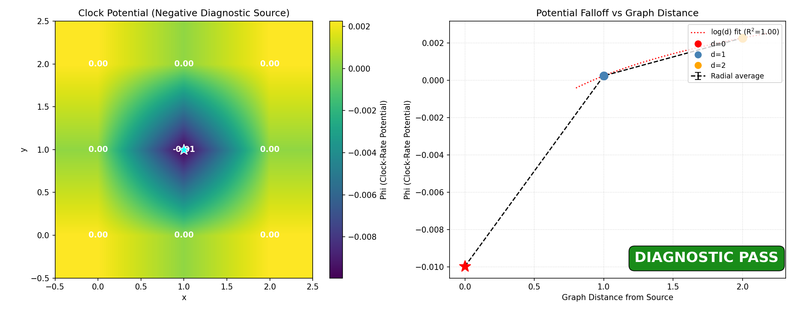

# Negative-source clock-constraint diagnostic

This example validates a numerical graph Green-function solve and the project’s
clock/redshift sign convention. It is not evidence for a physical source law,
Newtonian gravity, or General Relativity.

## Run

```text
uv run python -m examples.physics_qg.gravity_well
```

The example first infers a weighted graph from the 3×3 Heisenberg state. It then
manually injects a small negative source at the center and solves

`(L_w + μ² I) Φ = source`

with `μ=0.1`, removal of the finite-graph constant source mode, mean-zero potential
normalization, and an explicit constraint residual.

## Sign convention

The code uses

- `dτ ∝ exp(Φ)` for local clock rate; and
- `1+z = exp(Φ_observer - Φ_emitter)` for stationary emitter/observer redshift.

Therefore a gravity-like diagnostic well must have a negative source, smaller Φ near
the source, slower clocks there, and positive redshift for light emitted in the well
and observed at the boundary.

## Current finite result

For source strength `-0.01` on the 3×3 inferred graph:

- Φ at the center is approximately -0.0100;
- the outer-shell average is approximately +0.0023;
- Φ rises monotonically over the two available graph-distance shells;
- lattice-shell asymmetry is numerically zero at reported precision;
- the constraint residual is below `1e-17`;
- `1+z ≈ 1.0123`; and
- the source clock rate is about 0.9879 times the boundary rate.

The Green-function diagnostic itself passes its solver checks. The enclosing
projection does not: its configured singleton resolution has retention loss
approximately 3.44 against a 0.1 bound. The committed artifact therefore records
`overall_pass: false` and keeps the downstream solve explicitly conditional.



Only two nonzero radial shells exist, so the displayed log-distance fit has no power
to establish a continuum Green function. Exact lattice symmetry follows from the
symmetric controlled input and is a solver regression, not evidence for a universal
law.

## Source separation

The comparison figure deliberately separates:

- the pipeline’s local von Neumann entropy placeholder, which is not the proposed
  Araki/KMS source; and
- the manually injected negative Green-function source used for this diagnostic.

Scientific tests elsewhere in the repository show that raw relative entropy and its
induced potential scale quadratically near a faithful reference. Modular energy is
exactly linear only for the affine-mixture identity regression; response order for a
non-affine family must be tested separately. Accordingly, the physical source remains
unresolved.

## Artifacts

- `results/gravity_well.png`
- `results/gravity_embedding.png`
- `results/source_comparison.png`
- `results/validation.json`

The JSON labels the run `numerical_green_function_diagnostic` and explicitly records
that no physical source law was validated.
