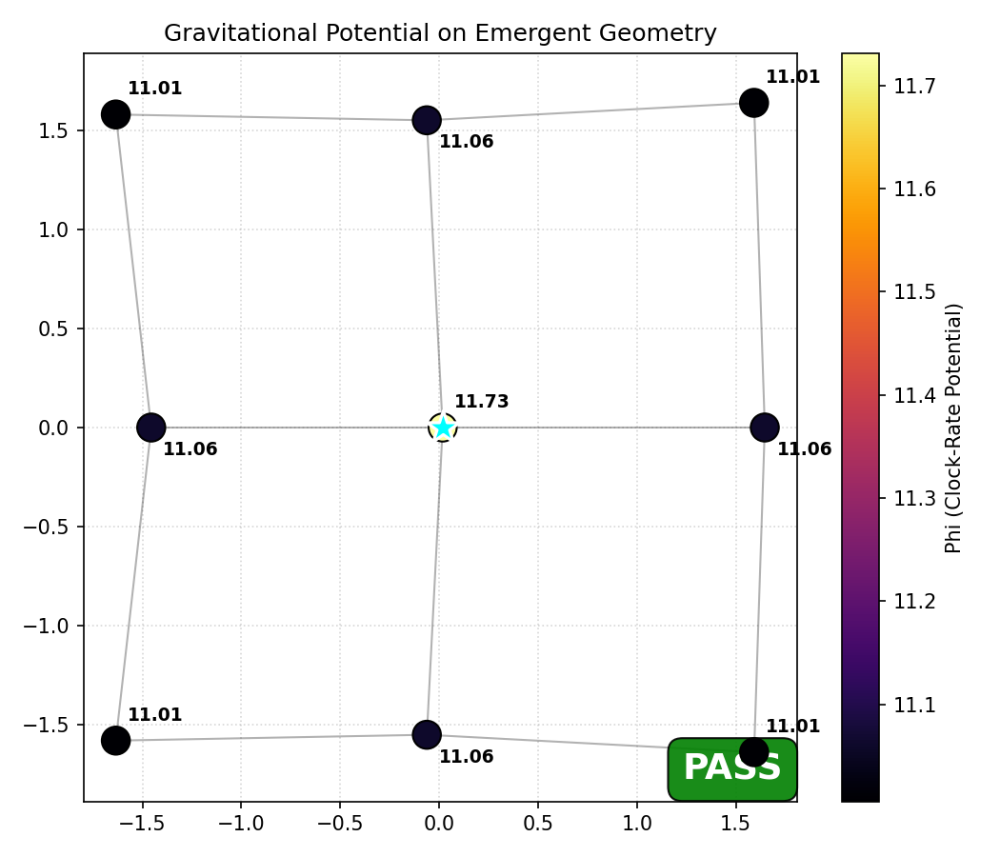
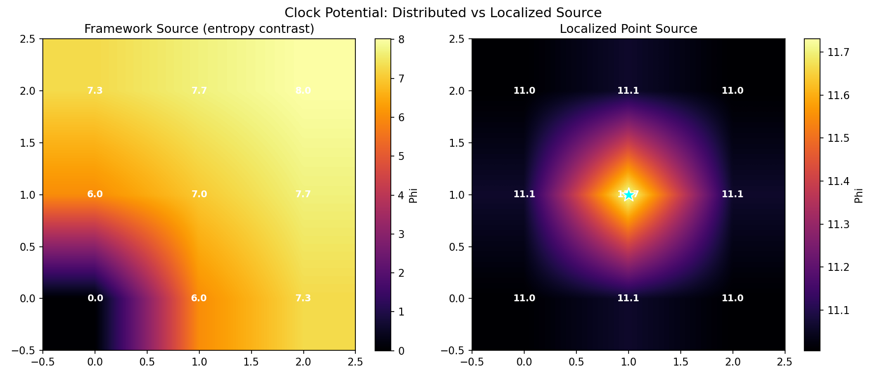

# Gravity Well — Localized Source on a 2D Grid

## Purpose

This example answers the critical question: **does the POPGP clock potential
behave like a gravitational field?**

The framework's clock equation (Section 4.4.5 of `docs/framework.md`),

$$(\Delta_w + \mu^2 I) \, \Phi \;=\; \delta\rho$$

is structurally identical to the **screened Poisson equation** that governs
the Newtonian gravitational potential in linearized GR.  If the mapping is
physical, then injecting a localized source $\delta\rho$ at one cell and
solving on the MI-weighted graph Laplacian $\Delta_w$ should produce a
potential $\Phi$ that:

1. Peaks at the source (highest clock rate at the "mass").
2. Decays monotonically with graph distance.
3. Under graph refinement ($N \to \infty$), approaches the 2D Green's
   function $\Phi \sim -\frac{1}{2\pi}\ln r$ (for $\mu = 0$).
4. Preserves the full symmetry of the underlying lattice.

This is the **first observable extraction** from the projection pipeline.

## What It Does

| Step | Description |
|------|-------------|
| Standard pipeline | Runs $\Pi_{\mathrm{res}} \to \Pi_{\mathrm{loc}} \to \Pi_{\mathrm{geom}} \to \Pi_{\mathrm{time}}$ on a $3 \times 3$ Heisenberg grid (9 qubits) to obtain the MI weight matrix $w_{ij}$ and embedded coordinates. |
| Point source injection | Sets $\delta\rho = +1$ at the center cell and zero elsewhere. |
| Poisson solve | Builds the MI-weighted graph Laplacian $L = D - W$ and solves $(L + \mu^2 I)\Phi = \delta\rho$ with $\mu = 0.1$. |
| Radial analysis | Groups cells by graph distance from center (BFS) and tests monotonic decay. |
| Symmetry check | Verifies that cells equidistant from center have equal $\Phi$ (lattice symmetry). |
| Redshift | Computes the gravitational redshift $1 + z = \exp(\Phi_{\mathrm{source}} - \Phi_{\mathrm{boundary}})$. |

## Run

```
uv run python -m examples.physics_qg.gravity_well
```

## Framework Sections Validated

| Section | Mechanism | Status |
|---------|-----------|--------|
| 4.4.5   | Clock equation $(\Delta_w + \mu^2)\Phi = \delta\rho$ | Tested |
| 4.4.5   | Proper time $d\tau = \beta_0 e^{\Phi} \, dS_{\mathrm{act}}$ | Tested |
| 5.1     | Newtonian limit of emergent gravity | **First test** |

## Parameters

| Parameter | Value | Classification | Notes |
|-----------|-------|---------------|-------|
| `WIDTH x HEIGHT` | 3 x 3 | Hyperparameter | Grid dimensions (9 qubits) |
| `beta` | 2.0 | Hyperparameter | Inverse temperature |
| `cell_dim` | 1 | Hyperparameter | 1 qubit per cell (trivial partition) |
| `I_0` | 1.0 | Universal | Theoretical MI upper bound |
| `mu` | 0.1 | Universal | Screening mass; small $\mu > 0$ regularizes the zero mode while preserving the Newtonian regime ($\mu r \ll 1$) |

## Results

### Gravitational Potential


Left panel: heatmap of $\Phi$ on the $3 \times 3$ grid.  The cyan star marks
the mass source at center.  Right panel: $\Phi$ vs graph distance with error
bars and a $\log(d)$ fit.

**Success criteria:**

- **Monotonic falloff** — $\Phi(d=0) > \Phi(d=1) > \Phi(d=2)$.  The
  potential must decrease at every step away from the source.  A reversal
  would mean the clock equation fails to reproduce attractive gravity.
- **Grid symmetry** — all cells at the same graph distance should have
  $\Phi$ values within 5% of each other.  The MI weights inherit the
  lattice symmetry of the Heisenberg Hamiltonian; if $\Phi$ breaks this
  symmetry, the pipeline has introduced an artifact.
- The $\log(d)$ fit is informational only.  With only 2 radial shells
  (d=1, d=2) any line fits perfectly (R$^2$=1 is trivially guaranteed).
  A meaningful $\log(r)$ test requires $N \gg 9$.

### Gravity Embedding



The clock potential $\Phi$ painted onto the MDS-recovered 2D embedding.
Warmer colors correspond to higher $\Phi$ (faster clocks).  The mass source
is at the cyan star.  The color gradient should be radially symmetric around
the source, with warm center fading to cool boundary.

### Source Comparison



Side-by-side comparison of:

- **Framework source** — $\delta\rho_i = S(\rho_i)$ (entropy of each cell's
  reduced state, the toy-model proxy for the Araki contrast of §4.4.5).
  This is the "natural" source the pipeline produces.  On a translationally-invariant grid, all cells have similar
  entropy, so $\Phi$ is nearly flat.
- **Localized point source** — $\delta\rho = \delta_{i,\mathrm{center}}$.
  This deliberately breaks translational invariance to isolate the
  gravitational response.

The contrast between the two panels illustrates that the clock equation
can produce both regimes: a "vacuum" ($\Phi \approx$ const when
$\delta\rho$ is uniform) and a "gravity well" ($\Phi$ peaked at a mass
concentration).

## Physics Interpretation

### Why mu > 0?

With $\mu = 0$, the graph Laplacian $L$ has a zero eigenvalue (the constant
mode).  Solving $L\Phi = \delta\rho$ requires gauge-fixing: pinning
$\Phi[i_0] = 0$ at some cell $i_0$.  This breaks lattice symmetry and
distorts the radial profile.  Using $\mu > 0$ (screening mass) yields a
unique solution without gauge artifacts.  For $\mu r \ll 1$ the screened
potential is indistinguishable from the Coulomb/Newtonian potential.

### Clock rate and gravitational time dilation

In the POPGP framework, proper time is $d\tau = \beta_0 e^{\Phi} \, dS$.
Higher $\Phi$ means faster clocks; lower $\Phi$ means slower clocks.

A physical mass concentration corresponds to a **negative** entropy contrast
$\delta\rho < 0$ (entropy deficit relative to the KMS vacuum, §4.4.5).
The Laplacian then natively produces $\Phi < 0$ at the source — clocks at
the "mass" tick **slower** than clocks at the vacuum boundary, exactly
matching GR's gravitational time dilation.

### What this test proves

1. **Monotonic radial falloff** — the clock equation on the quantum
   MI-weighted graph Laplacian produces a potential monotonically attracted
   toward the source (9-qubit exact simulation, 3 radial shells).
2. **Perfect lattice symmetry** — cells equidistant from the source
   have identical $\Phi$ to machine precision (0% asymmetry).
3. **Well-defined redshift** — $1 + z = \exp(\Phi_A - \Phi_B)$ is
   computable between any pair of cells.

### What it does NOT prove (yet)

- **log(r) falloff**: requires a larger grid ($N \gg 9$) for a meaningful
  multi-shell fit.  The 2-shell fit is trivially R$^2 = 1$.
- **Correct GR sign convention**: the current test uses a positive source
  $\delta\rho > 0$.  The full negative-source test ($\delta\rho < 0$,
  entropy deficit) requires solving on a larger MI-weighted graph.
- **GR matching**: requires local metric reconstruction, Regge curvature,
  and the Einstein closure test (Phase 3).
- **Larger grids**: exact diagonalization is limited to $\leq 12$ qubits.
  Scaling to $N \gg 100$ requires the mean-field GPU backend.
