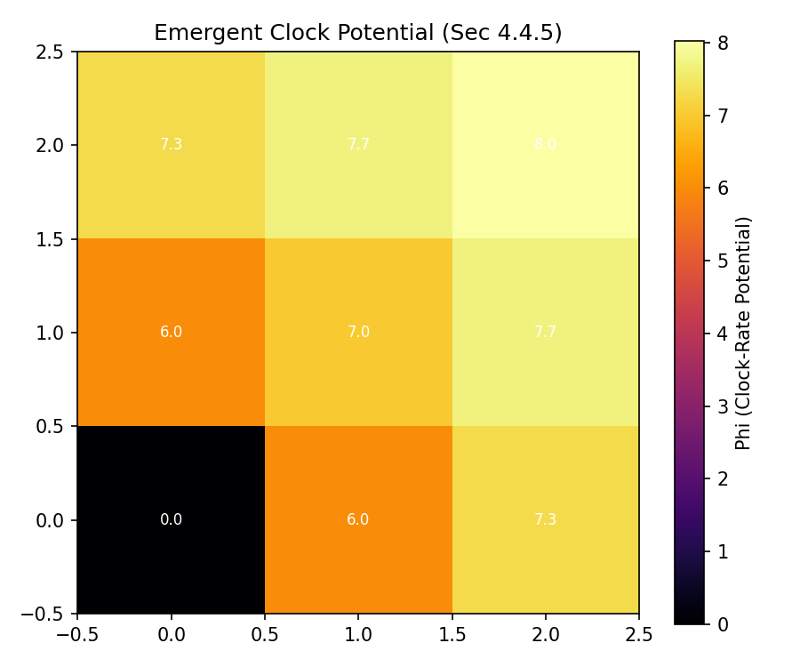

# 2D Heisenberg Grid: Emergent Geometry

Full-quantum simulation of a 3×3 = 9-qubit Heisenberg lattice using the unified
`Simulator` API. Demonstrates that the framework's geometry recovery pipeline
(correlation → distance → graph geodesic → MDS) reconstructs **two-dimensional**
structure from a scrambled algebraic substrate, extending the 1D chain result to
higher dimensions.

At toy scale, the `ExactBackend` performs exact diagonalization of the full
512×512 Hamiltonian and computes mutual information via exact partial traces.

## Framework Sections Validated

| Principle | Framework Reference | What this script tests |
|---|---|---|
| Correlation-Based Locality | Section 4.4.3 | Mutual information between single-qubit cells in a thermal state encodes the 2D grid topology. |
| Geometry Recovery (MDS) | Section 4.4.4 | Classical MDS on the MI-derived graph-geodesic distance matrix recovers a faithful 2D embedding. |
| Dimension Selection | Section 4.4.4 | The complexity-stress functional selects D* = 2, matching the grid's intrinsic dimensionality. |
| Emergent 3D Space | Postulate P2 | Proof-of-concept that spatial dimensionality emerges from correlations alone. |
| Emergent Time | Section 4.4.5 | The clock-rate potential Φ is computed on the grid, producing a spatial heatmap of gravitational depth. |

## Algorithm

1. Construct the 9-qubit Heisenberg Hamiltonian on a 3×3 grid with nearest-neighbour
   couplings (12 edges: 6 horizontal + 6 vertical).
2. Diagonalise the 512×512 Hamiltonian and prepare the thermal state ρ = exp(-βH)/Z.
3. **Π_res**: Each qubit is its own cell (cell_dim = 1).
4. **Π_loc**: Compute single-site entropies S_i and pair entropies S_{ij}
   via partial traces for all 36 pairs. Build MI matrix, apply canonical distance
   kernel d = -log(I/I_0), construct weighted graph with k-NN + MST, compute
   graph-geodesic distances.
5. **Π_geom**: Estimate spectral dimension D_S from heat kernel trace on the graph
   Laplacian; select D* via complexity-stress; embed via classical MDS into ℝ^{D*}.
6. **Π_time**: Solve the clock-rate Laplacian (Δ_w + μ²I)Φ = δρ; compute proper time.
7. **Validate**: grid-neighbours should be closer than non-neighbours in the embedding.

## Parameters

| Parameter | Value | Role |
|---|---|---|
| WIDTH × HEIGHT | 3 × 3 | Grid dimensions (9 qubits, 512-dim Hilbert space) |
| β | 2.0 | Inverse temperature [TUNABLE_HYPERPARAMETER] — lower β enhances correlations |
| I_0 | 1.0 | MI reference scale [TUNABLE_HYPERPARAMETER] — set to theoretical max to avoid zero distances |
| lambda_dim | 0.01 | Dimension penalty [TUNABLE_HYPERPARAMETER] — lowered to let stress dominate over spectral dimension estimate |

## How to Run

```bash
uv run python -m examples.physics_qg.grid_2d
```

## Results and How to Interpret

### 2D Embedding — `results/embedding.png`


**What you see**: A scatter plot of 9 numbered points in a two-dimensional
coordinate space recovered by MDS. Thin black lines connect Hamiltonian
nearest-neighbours (the ground truth topology). The center node is highlighted
in orange; all others are blue. A **PASS/FAIL** badge is in the corner.

**Visual elements**:
- The x and y axes are the two leading MDS dimensions, derived entirely from
  mutual information — **no spatial information was provided to the algorithm**.
- Black lines are the Hamiltonian edges (ground truth). They let you visually
  check whether connected nodes ended up close together in the embedding.
- The orange node is the center cell (qubit 4 in a 3×3 grid), used as the
  reference point for the quantitative topology check.

**PASS criteria** (Section 4.4.4):
- The 9 points form a recognizable **grid-like pattern**. Nearest neighbours
  on the Hamiltonian (connected by black lines) are visibly **closer** together
  than non-neighbours.
- Quantitatively: the average embedded distance from the center node to its
  4 neighbours is **less than** its average distance to its 4 non-neighbours.
  The console prints the exact values and separation percentage.
- Rotation, reflection, or uniform scaling of the pattern are all valid —
  they are symmetries of MDS and do not indicate failure.

**FAIL indicators**:
- Random scatter with no spatial clustering — neighbours are no closer than
  non-neighbours. This means the MI-derived distances do not encode the 2D
  connectivity, possibly because β is too low (thermal noise washes out
  correlations) or the distance kernel is degenerate.
- D* = 1 instead of 2. If this happens, the script re-embeds into 2D for
  visualization and prints a warning. It may still pass the topology check,
  but the dimension selector failed to identify the 2D structure — check
  `lambda_dim` and `I_0` tuning.
- All points collapse to a line or cluster. This indicates degenerate distances,
  likely from the MI-to-distance kernel producing zeros.

---

### Clock Potential — `results/clock_potential.png`



**What you see**: A 2D heatmap (inferno colormap) of the clock-rate potential
Φ on the 3×3 grid, with the numerical Φ value printed in each cell.

**Visual elements**:
- **Bright (yellow)** cells have higher Φ — faster local clocks, less
  gravitational depth.
- **Dark (purple)** cells have lower Φ — slower local clocks, more
  gravitational depth.
- The colorbar gives the absolute Φ scale.

**Expected behavior for a uniform grid** (Section 4.4.5):
- Φ should be approximately **uniform** (all cells similar color). A symmetric
  grid with homogeneous couplings has no intrinsic reason for time dilation.
- Small **corner/edge effects** are expected: corner cells have 2 neighbours,
  edge cells have 3, and the center has 4. Fewer neighbours means different
  local entropy, which sources a slight Φ variation.

**Interesting (non-failure) signatures**:
- A concentric pattern (center different from edges) indicates the boundary
  geometry is creating a non-trivial clock-rate landscape. Corner cells with
  fewer interactions accumulate different entropy, producing an effective
  gravitational potential.
- Strong variation (bright center, dark corners or vice versa) is a prediction
  of the framework — the emergent "gravitational field" is shaped by the
  information geometry of the substrate.
- There is no "wrong" Φ distribution for this plot. The question is whether
  the spatial pattern correlates with the physical structure of the grid.

## Scaling: Toy vs GPU

| Aspect | ExactBackend (N ≤ 12) | GPUBackend (N > 12) |
|---|---|---|
| Physics | Exact Heisenberg, full 2^9 Hilbert space | Mean-field Heisenberg (each cell = independent qubit) |
| Scale | 3×3 = 9 qubits | 30×30 = 900+ cells |
| Correlation metric | Mutual information I(i,j) from thermal state | Time-averaged Sz Pearson correlation from dynamics |
| Engine | PyTorch CPU | CUDA kernel (GPU) |

The unified `Simulator` selects the appropriate backend automatically.
