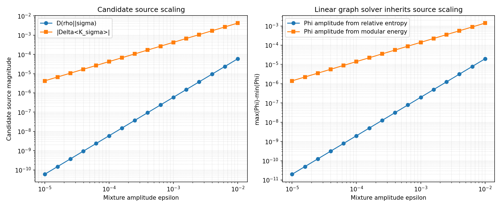

# Source-law linear-response experiment

This controlled experiment compares two vacuum-relative candidates under

`rho(epsilon) = (1-epsilon) sigma + epsilon rho_exc`.

It measures relative entropy, modular-energy variation, entropy change, and the
clock-potential amplitude produced by each candidate on the same three-node graph.

```text
uv run python -m examples.physics_qg.source_law
```

Expected and observed behavior:

- `D(rho(epsilon)||sigma)` begins at order epsilon squared;
- `Delta<K_sigma>` is exactly proportional to epsilon for this affine family;
- the linear graph solver is exactly homogeneous in its source;
- a KMS qutrit control has equal-energy states with equal modular energy but
  different entropy and relative entropy.



This is a negative result for raw relative entropy as a standalone linear mass
source in the tested regime. The modular and solver linearities are analytic identity
regressions, not evidence for a physical source. The follow-up
[`source_law_many_body`](../source_law_many_body/README.md) experiment tests
localization, conservation, and spreading in one exact interacting chain; covariance,
robustness, and many-body refinement remain open.
