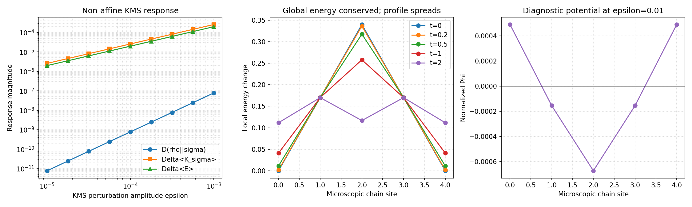

# Localized many-body KMS source-law experiment

This exact five-site Heisenberg-chain experiment tests whether a localized microscopic
energy-density candidate has a nonzero susceptibility in a genuinely non-affine KMS
family, rather than inheriting unit slope from an affine mixture by construction.

```text
uv run python -m examples.physics_qg.source_law_many_body
```

The response family is
`rho(epsilon) proportional to exp[-beta(H + epsilon V)]`, with localized
`V = -h_center`. It measures:

- global relative entropy, modular energy, entropy change, and physical energy;
- an explicit symmetric site-energy decomposition that sums to the Hamiltonian;
- global-energy conservation together with spreading of that site-energy profile
  under exact evolution (without a tested local continuity current); and
- the sign of a diagnostic graph potential sourced by negative local energy change.

The quadratic claim now has four independent numerical gates: nested-window
coefficients agree within `1e-3` relatively, the absolute log-log slope is within
`0.02` of 2, normalized RMSE is at most `1e-2`, and the smallest response exceeds an
absolute floating-point floor by at least `1000`. The fitted coefficient is also
compared with the exact Kubo--Mori coefficient. A synthetic first-order response must
fail the same gate.

First-order modular response is tested directly on the signed series using Richardson
extrapolation. Its magnitude must exceed ten times the combined truncation/roundoff
estimate and agree with the exact Kubo--Mori susceptibility. Energy and potential
power-law slopes remain descriptive; the energy slope is not a separate gate because
`Delta<K> = beta Delta<E>` is an analytic identity. The sweep includes `beta = 2.5`
and covers both Hamiltonian families through `beta = 3`, plus three small odd
Heisenberg-chain sizes.

Response order is family-specific. An isospectral local-unitary control has
`Delta S = 0` and `D = Delta<K> = beta Delta<E>`; these identities are gated at
roundoff scale while its quadratic slopes are descriptive. A separate
full local quench supplies the profile-spreading experiment; a commuting Ising control
retains a stationary profile, showing that spreading is dynamics-dependent.

The experiment also preserves an integration-level negative result: the earlier
one-site reduced-state modular source is numerically zero for the symmetric KMS
reference. A distinct exact-backend candidate based on `−β Δ⟨h_i⟩` recovers the
audited local-energy decomposition. It is accepted only for a supplied reference that
matches the Gibbs state of the same backend Hamiltonian and β within trace distance
`1e-10`; under that validated premise it sums to minus the global modular-energy
change. This is an explicit repair path, not a silent replacement or a claim of
uniqueness.

The interaction chain is supplied by the Hamiltonian, and the local-energy split is a
declared microscopic convention. A successful result therefore supports only the
feasibility of a localized test object in the declared finite KMS family. It does not
derive a family-independent first-order law, gravitational source, covariance, or a
continuum limit.


