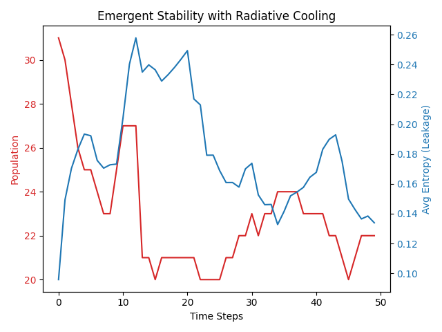
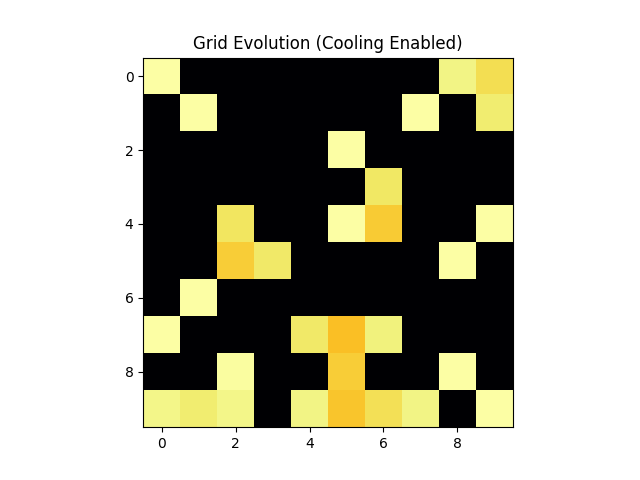

# Cellular Automata Emergent Stability Model

This component implements a cellular automata model where "cells" (1-qubit effective states on a Bloch sphere) interact, gain entropy, die if entropy exceeds a threshold, and replicate if stable. This model demonstrates the Stability Selection Principle and emergent biological-like persistence.

## Overview
We introduce a "Radiative Cooling" mechanism to allow stable, dense populations by shedding entropy. This demonstrates that open systems with entropy export are necessary for complex, stable structures. The model includes:
1.  **Interaction Phase:** Cells interact with neighbors, increasing local entropy (reducing purity).
2.  **Selection Phase:** Cells die if their entropy exceeds `LEAKAGE_THRESHOLD`.
3.  **Cooling Phase:** Cells have a small probability (`COOLING_PROB`) to reset their purity, simulating radiative cooling.
4.  **Reproduction Phase:** Stable cells replicate if they have space and are very pure.

## How to Run

```bash
uv run src/ca_model.py
```

## Results

The model demonstrates the emergence of stable populations that persist over time, balanced by selection and cooling.

### Population Dynamics


### Evolution Animation

