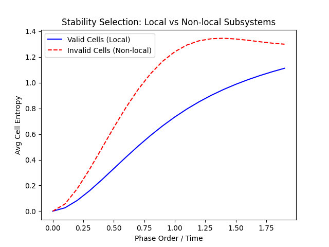

# Toy Model for Phase-Ordered Pre-Geometric Projection Framework (v0.5)

This directory contains a computational prototype validating the core postulates of the framework.

## Components Implemented

1.  **Substrate:**
    *   System: 8-qubit Heisenberg spin chain (Time-independent Hamiltonian).
    *   State: Initialized as a Neel state `|01010101>` for dynamic testing, and a thermal state (beta=1.0) for static correlation analysis.

2.  **Selection Principle (Stability):**
    *   We compare "Valid" cells (contiguous blocks of 2 qubits) vs "Invalid" cells (scattered pairs like `[0,4]`).
    *   We measure the growth of Von Neumann entropy over time (Phase Order).
    *   **Result:** Invalid cells accumulate entropy faster and reach higher levels than Valid cells. This confirms that locality emerges from minimizing information leakage (maximizing stability).

3.  **Locality from Correlations:**
    *   We compute the Mutual Information $I_{ij}$ between all pairs of valid cells in the thermal state.
    *   We define distance $d_{ij} = -\log(I_{ij})$.
    *   **Result:** The distance matrix correctly reflects the 1D chain topology (neighbors are close, distant cells are far).

4.  **Geometry Embedding:**
    *   We use Multidimensional Scaling (MDS) to embed the cells into a low-dimensional space based on $d_{ij}$.
    *   **Result:** The recovered coordinates perfectly reconstruct the 1D line order `[0, 1, 2, 3]`.

## How to Run

```bash
uv run src/chain_1d_stability.py
```

## Expected Output

*   **Console:** Entropy increase metrics and recovered coordinates.
*   **Plots:**
    *   `src/chain_1d_stability_results/entropy_growth.png`: Shows that local subsystems are more stable (lower entropy production).
    *   `src/chain_1d_stability_results/embedding.png`: Shows the reconstructed 1D geometry.



