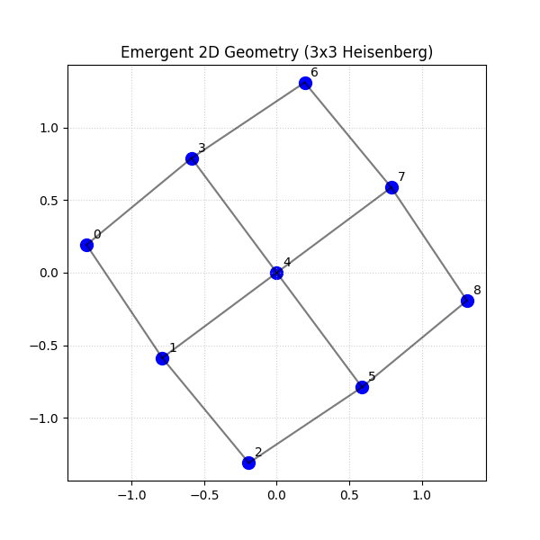

# 2D Grid Emergent Geometry Model

This component validates the framework's ability to recover higher-dimensional spatial structures from a "scrambled" algebraic input.

## Overview
We implement a 2D Heisenberg spin lattice (3x3 grid) and demonstrate emergent 2D geometry from correlations using Multidimensional Scaling (MDS). The system is initialized in a thermal state, and the distances between cells are derived from their mutual information.

## How to Run

```bash
uv run src/grid_2d.py
```

## Results

The model successfully reconstructs the 2D grid structure purely from the pairwise mutual information between cells, validating the projection map's ability to recover geometry.

### 2D Embedding Result

